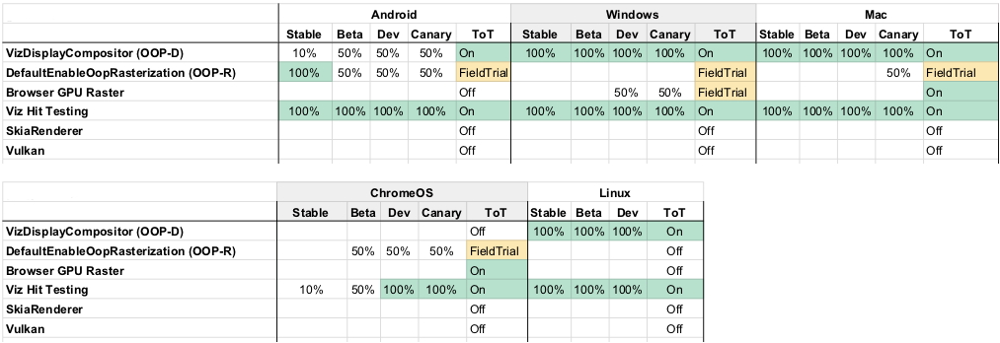

---
title: "Chrome/Vulkan Update"
author:
- "Robert Kroeger (*rjkroege@*)"
date: "April"
...
<!--
pandoc -t dzslides -s test.md -o habits.html ; cat habits.html | sed 's/margin-top: 200px;/margin-top: 20px;/' > slides.html
-->

## Why Vulkan?
> - Speed: Vulkan lowers draw call cost compared to GL
> - Speed: Parallelize `vkCommandBuffer` prep and dispatch
> - Stability: Vulkan ICD separately revable on Android (eventually) 

----

## Vulkan Port TL;DR
> - Vulkan's explicit model is incompatible with Chrome commandbuffer
> - So move rasterization and compositing into <strike>GPU</strike> Viz process
> - Couple rasterization and compositing more tightly to the GPU for improved performance.

----

# Components

<!-- picture of moving compositor to the viz -->

  <object data="viz-components-viz.svg" height="220" alt="Viz Components"></object>

# OOP-D

<!-- picture of moving compositor to the viz -->

  <object data="viz-from-browser-yesno-oopd.svg" height="440" alt="With/Without OOPD"></object>

# OOP-R

<!-- picture of moving compositor to the viz -->

  <object data="viz-from-browser-yesno-oopr.svg" height="440" alt="With/Without OOPR"></object>

# SkiaRenderer

<!-- picture of moving compositor to the viz -->

  <object data="oopd-command-buffer-skddl.svg" height="440" alt="SkiaRenderer"></object>

# SharedImage & Vulkan

<!-- picture of moving compositor to the viz -->

  <object data="viz-inside-sharedimage.svg" height="440" alt="Viz Vulkan Details"></object>

# Status

# Perf
> - CPU utilization currently at parity between SkiaRenderer and GLRenderer
> - More optimizations planned

# Future Work
> - Launch more
> - SkDDL recording optimizations
> - Compositor Delegation to overlays
> - Parallel recording of SkDDL from RasterInterface
> - Skia/Metal, Skia/DX?
> - ?
