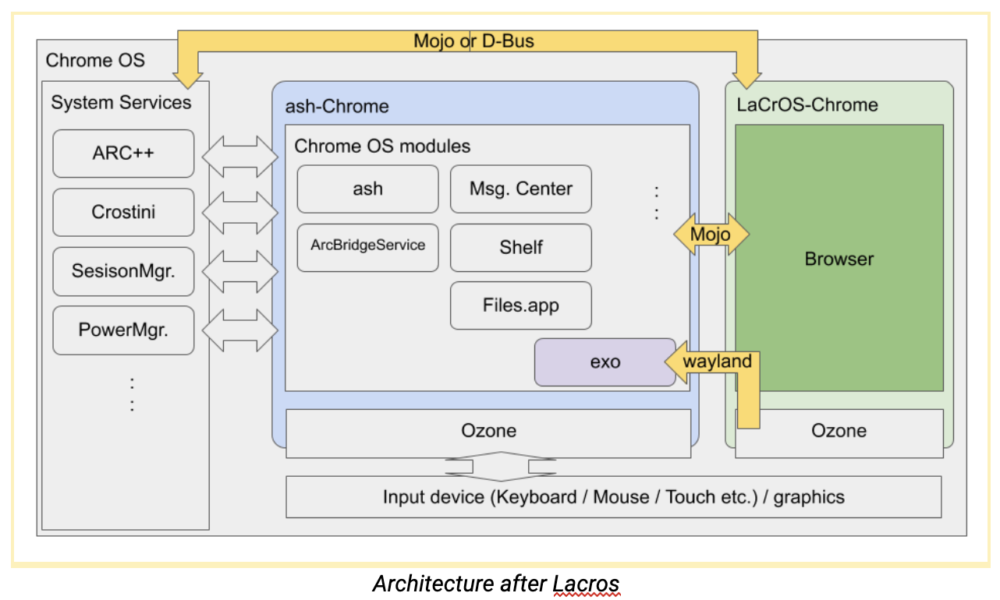

---
title: "LaCrOS Overview"
author:
- "Robert Kroeger (*rjkroege@*)"
date: "August"
...
<!--
pandoc -t dzslides -s lacrosoverview.md  | sed 's/margin-top: 200px;/margin-top: 20px;/' > lacrosoverview.html
-->

# What's LaCrOS

> - Split the browser from Ash and kernel etc.
> - So that the browser functionality is a separate binary

# LaCrOS Approach

  </img>

# History

> - Igalia wrote chrome/ozone/wayland platform
> - Mus had unclear goals: servicifying? splitting? promos?
> - Attempted to clarify with [Pragmatic CrOS/Chrome Split](https://docs.google.com/document/d/1jZE03KYB-Bk7EieITcO-hix7fZ8qydtnnUpihvcwNsk/edit)
> - Meh then
> - Restarted recently

#  Disclosure  Note

> - LaCrOS is (obviously) public
> - Try not to be too loud about it
> - *Why LaCrOS now* is Google confidential
> - So Why?: I'll tell you later.

# Other Approaches

> - Other ways to do this
> - LaCrOS team argues that this is the least effort approach
> - I focused on the graphics issues

# Graphics Issues

> - Work Overview: [go/lacrosfit](https://goto.google.com/lacrosfit)
> - TL;DR: LaCrOS Chrome works
> - With  missing features
> - And graphics performance regressions
> - Fishfood it now: Googlers can flip the flag "LaCrOS Support", install and run!

# Missing Features

> - Media: hardware video playback, DRM, screen capture
> - Rich display: multi-monitor, HDR, DPI-variations
> - Chrome/Linux/Wayland issues: tab dragging, dialogs

# Regression: Compositing

  <object data="perf-why-extra-work-simplified.svg" height="300" alt="Double Composite"></object>

# "Easy" Fix

  <object data="perf-why-lacros_chrome.svg" height="340" alt="Double Composite"></object>

# Still Regresses

> - Only one overlay: use it for Arc++ *or* LaCrOS etc.
> - Overlay memory, scan out power draw
> - Double compositing cases remain
> - Web contents perf "predictable". UI not so

# Measuring UI Performance

  <object data="perf-why-poc-testing.svg" height="360" alt="Double Composite"></object>

# Dashboard

> - Tast Framework
> - Separate tests for the various UI cases
> - [crosbolt](https://crosbolt.googleplex.com/time_series/tast.ui.OverviewPerf.lacros?tab=time_series&sku_filter=eve_IntelR_CoreTM_i5_7Y57_CPU_1_20GHz_8GB%7Ceve_IntelR_CoreTM_i5_7Y57_CPU_1_20GHz_8GB.arcvm%7Ceve_IntelR_CoreTM_i7_7Y75_CPU_1_30GHz_16GB%7Ceve_IntelR_CoreTM_i7_7Y75_CPU_1_30GHz_16GB.arcvm&suite=crosbolt&test=tast.ui.OverviewPerf&metric=Ash.Overview.AnimationSmoothness.Enter.ClamshellMode.2windows)
> - Rollups and comparisons forthcoming

# "Hard" Fix: Delegation

  <object data="perf-why-delegated_compositing.svg" height="360" alt="Double Composite"></object>

# Dependency Chain

> - Finish Mac SkiaRenderer
> - Complete CrOS overlay reactoring
> - Make platform-independent version of ccameron@'s work
> - Wire it to enhanced ozone platform
> - Build ozone/wayland with subsurface tree

# Video

> - Two different approaches:
> - Use the mojo media service from LaCrOS-Chrome
> - Expose hardware-accelerated video via vaapi
> - Details still being sorted

# Demo

> - `go/present` is still broken ☹️
> - [video demo](https://drive.google.com/file/d/1YBwu7SlaS1u4RD1_yBdMtQjHpgvoptid/view?usp=sharing)

# Misc Notes

> - Weekly status: [go/lacrosfit-meeting](https://goto.google.com/lacrosfit-meeting)
> - Graphics work spans: ChromeOS GPU, Chrome GPU, Igalia contributors
> - Large project spans almost all Chrome and  CrOS teams

